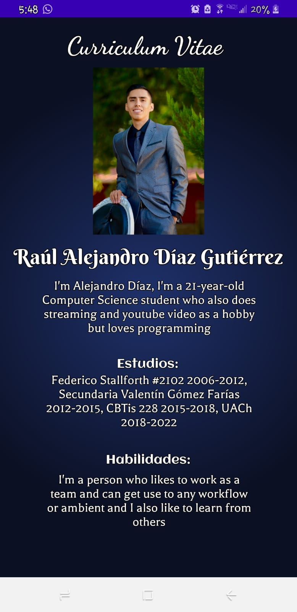

# Proyecto Tercer Parcial

Este repositorio fue creado para el proyecto del tercer parcial de la materia de Desarrollo Basado en Plataformas por Ximena Romero, Alejandro Díaz y Melissa Garcia. El link al repositorio de nuestra aplicación sobre los curriculums es https://github.com/xime-rom912/proyecto3.

## Descripción de los problemas

Para el tercer parcial se requiere realizar un proyecto para la plataforma Android que cumpla las siguientes características:

a) Debe implementar una interfaz visual que muestre los datos de su curriculum. (nombre completo, bio, educación y lista de habilidades).

b) Los datos deben provenir del servidor web creado en el proyecto del parcial II la ruta es /{matricula} (debe haber una ruta por cada integrante).

Se debe entregar una actividad que funcione como menú y que lleve a cada curriculum de cada miembro del equipo.

Entregable: Cada miembro del equipo deberá subir la liga de su repositorio en gitlab / github.

## Prerequisitos

**Node.js** Para ejecutar el servidor en la terminal de linux o windows.
**Android Studio** Para compilar y emular la aplicacion se debe contar con el programa de .

### Instalando

Para descargar e instalar Node.js se puede utilizar el siguiente comando en la terminal de linux:

```
sudo apt-get install nodejs
```

Para descargar e instalar Android Studio dar clic [aqui](https://developer.android.com/studio)

## Corriendo pruebas

Para correr el servidor local, solo se ejecuta el siguiente comando en la terminal de linux:

```
node app.js
```

Una vez que el servidor se este ejecutando, verificamos que el sitio web se encuentre activo al ingresar la siguiente dirección en el navegador:

```
localhost:8080
```

Una vez que nuestro servidor este corriendo, en otra terminal dentro de la misma carpeta escribiremos el siguiendo comando

```
./ngrok http 8080
```

el cual permite al programa de **ngrok** mostrar nuestro sitio en el puerto 8080 hacia las personas que compartamos el link.

Una vez ejecutado el comando, la pantalla de la terminal cambiará y nos mostrara dos enlaces similares con la unica diferencia siendo que uno es _http_ y el otro es _https_.


Copiamos el enlace **https** o **http** e iremos al programa de _Android Studio_ donde abriremos el proyecto de la [aplicación](https://github.com/xime-rom912/proyecto3).

Para que la aplicación pueda funcionar y obtener la información de nuestro servidor de ngrok solo hay que cambiar los enlaces de ngrok dentro del MainActivity.java

Una vez que hagamos ese cambio podremos compilar y correr la aplicación, la cual nos mostrará nuestra pantalla principal:


En la pantalla principal existen 3 botones, los cuales al hacer tap en alguno de ellos nos llevará al curriculum de la persona correspondiente:

### Alejandro Díaz



### Melissa Garcia


### Ximena Romero


## Construido con

- Visual Studio Code - Editor de texto
- Node.js - Entorno para ejecutar JS (EC6)
- Android Studio - IDE oficial para la plataforma Android

## Contribuiciones

No se acepta contribución alguna (por lo pronto)

## Autores

- **Ximena Romero Chavéz** - [Repositorio](https://github.com/xime-rom912)
- **Raúl Alejandro Díaz Gutiérrez** - [Repositorio](https://github.com/a329782)
- **Melissa García Mendoza** - [Repositorio](https://github.com/moonormal)

## Licencia

Libre licencia.

## Agradecimientos

Gracias a las personas de PurpleBooth por su plantilla/referencia de como debe ser el [formato de un readme](https://gist.github.com/PurpleBooth/109311bb0361f32d87a2).
